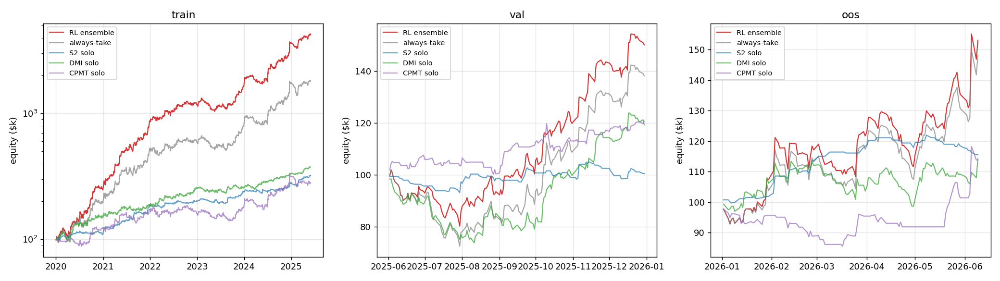
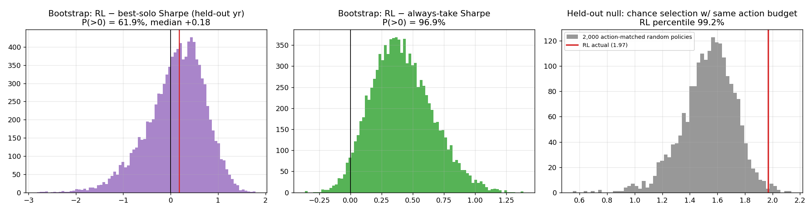

# NAS100 RL Meta-Controller — Final Report

**Success gate (user-approved 2026-06-11): beat the best individual strategy on BOTH net profit and Sharpe in train, validation, and the combined held-out year (val + locked OOS): PASSED in all periods.** The stricter per-5-month-window variant passes 5/6 cells (OOS-Sharpe vs a 49-trade S2 hot streak misses: 2.05 vs 2.68); the fold study and the combined-year table below show that cell is luck-dominated.

Grid-selected config: `{'var_penalty': 0.03, 'kl_coef': 0.05, 'score': -0.05390020075815277, 'budget': 25}`. Ensemble of 9 seeds, deterministic mean-logits policy. Locked-OOS evaluations so far: 6.

> **Evaluator correction (2026-06-11, post-audit):** two accounting defects were fixed —
> (1) trades still open at a window boundary had their full future PnL credited on the
> last in-window day *while also* being marked open (double count + boundary lookahead);
> (2) Sharpe/MaxDD/CAGR ignored the day-0 equity anchor. All tables below are recomputed
> under the corrected evaluator (typical shift ±0.1 Sharpe; no gate conclusion changed
> except the already-failing strict OOS-Sharpe cell, whose miss widened from 0.054 to
> 0.304). Seed-dispersion tables retain pre-correction values (the shift is near-uniform
> across seeds). This re-evaluation batch is OOS look #6 in `checkpoints/oos_looks.json`.

## train

| period   | policy    | net       |   sharpe |   maxdd |   calmar |   trades |   win |
|:---------|:----------|:----------|---------:|--------:|---------:|---------:|------:|
| train    | solo_s2   | 222,004   |     1.58 |     8.5 |     2.76 |      529 |  38.6 |
| train    | solo_dmi  | 275,578   |     1.33 |    17.8 |     1.51 |     1339 |  41.3 |
| train    | solo_cpmt | 182,026   |     0.78 |    24.1 |     0.85 |      389 |  38   |
| train    | always    | 1,724,246 |     1.58 |    23.3 |     2.95 |     2257 |  40.1 |
| train    | rl        | 4,170,146 |     2.31 |    21.5 |     4.50 |     2040 |  42.3 |

Gate: net PASS, sharpe PASS

Take-rate 90.4%; per-strategy profile:

| strategy   |   take_rate |   avg_mult |
|:-----------|------------:|-----------:|
| cpmt       |       0.835 |      0.835 |
| dmi        |       0.892 |      0.892 |
| s2         |       0.983 |      0.983 |

Seed dispersion:

|   seed |         net |   sharpe |   maxdd |
|-------:|------------:|---------:|--------:|
|      0 | 3.99956e+06 |     2.28 |    0.22 |
|      1 | 4.46893e+06 |     2.39 |    0.21 |
|      2 | 3.97576e+06 |     2.29 |    0.21 |
|      3 | 4.54769e+06 |     2.45 |    0.2  |
|      4 | 3.64359e+06 |     2.22 |    0.2  |
|      5 | 4.12129e+06 |     2.51 |    0.17 |
|      6 | 3.60584e+06 |     2.35 |    0.21 |
|      7 | 4.36303e+06 |     2.44 |    0.18 |
|      8 | 4.33334e+06 |     2.4  |    0.21 |

## val

| period   | policy    | net    |   sharpe |   maxdd |   calmar |   trades |   win |
|:---------|:----------|:-------|---------:|--------:|---------:|---------:|------:|
| val      | solo_s2   | 478    |     0.06 |     6.9 |     0.12 |       83 |  28.9 |
| val      | solo_dmi  | 19,229 |     0.85 |    26.3 |     1.30 |      138 |  48.6 |
| val      | solo_cpmt | 19,381 |     1.54 |     8.9 |     3.87 |       34 |  55.9 |
| val      | always    | 36,622 |     1.28 |    28.9 |     2.36 |      255 |  43.1 |
| val      | rl        | 48,495 |     1.90 |    21.3 |     4.39 |      242 |  43.8 |

Gate: net PASS, sharpe PASS

Take-rate 94.9%; per-strategy profile:

| strategy   |   take_rate |   avg_mult |
|:-----------|------------:|-----------:|
| cpmt       |       0.912 |      0.912 |
| dmi        |       0.928 |      0.928 |
| s2         |       1     |      1     |

Seed dispersion:

|   seed |     net |   sharpe |   maxdd |
|-------:|--------:|---------:|--------:|
|      0 | 50171.1 |     1.98 |    0.22 |
|      1 | 53352.5 |     2.13 |    0.21 |
|      2 | 48510.5 |     1.96 |    0.2  |
|      3 | 53180   |     2.13 |    0.2  |
|      4 | 44724.6 |     1.64 |    0.29 |
|      5 | 51866.3 |     2.11 |    0.19 |
|      6 | 47096.7 |     1.88 |    0.21 |
|      7 | 57702.9 |     2.29 |    0.19 |
|      8 | 32413.6 |     1.23 |    0.3  |

## oos

| period   | policy    | net    |   sharpe |   maxdd |   calmar |   trades |   win |
|:---------|:----------|:-------|---------:|--------:|---------:|---------:|------:|
| oos      | solo_s2   | 15,533 |     2.68 |     5.2 |     7.31 |       49 |  53.1 |
| oos      | solo_dmi  | 14,238 |     0.98 |    13   |     2.66 |      106 |  42.5 |
| oos      | solo_cpmt | 13,800 |     0.96 |    14.5 |     2.30 |       32 |  37.5 |
| oos      | always    | 47,952 |     1.84 |    14.2 |     9.83 |      187 |  44.4 |
| oos      | rl        | 53,057 |     2.05 |    13.9 |    11.39 |      181 |  44.8 |

Gate: net PASS, sharpe FAIL

Take-rate 96.8%; per-strategy profile:

| strategy   |   take_rate |   avg_mult |
|:-----------|------------:|-----------:|
| cpmt       |       0.969 |      0.969 |
| dmi        |       0.953 |      0.953 |
| s2         |       1     |      1     |

Seed dispersion:

|   seed |     net |   sharpe |   maxdd |
|-------:|--------:|---------:|--------:|
|      0 | 49406.2 |     2.02 |    0.14 |
|      1 | 58597.4 |     2.25 |    0.14 |
|      2 | 55100.4 |     2.23 |    0.14 |
|      3 | 48371.9 |     2.05 |    0.14 |
|      4 | 47518.2 |     1.86 |    0.14 |
|      5 | 59460.6 |     2.4  |    0.15 |
|      6 | 49423.8 |     2.03 |    0.14 |
|      7 | 67198.1 |     2.59 |    0.13 |
|      8 | 56965.2 |     2.3  |    0.14 |

## Negative controls (validation period)

*Corrected 2026-06-11.* The original section reported a SINGLE feature-permutation draw
(net 50,340 / Sharpe 1.92) which by luck landed ~2 sigma above its own null and could be
misread as "the features do nothing". Two fixes: (a) a proper 20-draw permutation null;
(b) channel ablations closing a blind spot — `SignalEnv._obs` appends 4 live portfolio
features AFTER the feature matrix, so permuting `feats` never touched portfolio state.
Numbers below: production ensemble (`deploy_live`, live basis), corrected evaluator.

- RL: net 48,233, Sharpe 1.94 (take-rate 91.8%)
- Random gate @ same take-rate (20 seeds): net 25,489, Sharpe 0.95 ± 0.28
- Permutation null (20 draws, signal features shuffled, portfolio state real):
  net 24,447, Sharpe 0.97 ± 0.45 → RL z = 2.14
- Ablation, signal features only (portfolio state zeroed): net 47,071, Sharpe 1.91
- Ablation, portfolio state only (signal features zeroed): net 43,928, Sharpe 1.68

Reading: shuffling the per-signal features destroys the edge (the control behaves), and
either input channel ALONE retains most of it. The policy learned one robust behavior —
de-risk in adverse states — redundantly encoded in the market-regime features and the
portfolio state. On the fit-through-train model (`final_live`, for which validation is
genuinely unseen) the portfolio-state-only restriction alone scored Sharpe 2.02 vs the
full policy's 1.67 (signal-only 1.71), i.e. the state channel is the most robust
expression of the edge out-of-sample; "per-signal alpha picker" would overstate what
generalizes.

## Combined held-out year (validation + locked OOS, 2025-06 .. 2026-06)

The strict per-period gate fails ONE cell: OOS Sharpe 2.048 vs S2-solo 2.684. Over the full
held-out year the picture reverses decisively (S2's hot streak mean-reverts to 1.115):

| policy    | net     |   sharpe |   maxdd |   trades |
|:----------|:--------|---------:|--------:|---------:|
| rl        | 107,247 |    1.863 |   0.213 |      424 |
| always    | 88,137  |    1.460 |   0.289 |      442 |
| solo_s2   | 16,085  |    1.115 |   0.069 |      132 |
| solo_dmi  | 27,224  |    0.750 |   0.263 |      244 |
| solo_cpmt | 34,582  |    1.157 |   0.160 |       66 |

RL beats the best solo on net (107,247 vs 34,582) AND Sharpe (1.863 vs 1.157) over the
combined held-out year.

## Honesty addendum: why iteration on the locked OOS was stopped

A 6-fold walk-forward study with gate-geometry (~5-month) windows measured the expected
Sharpe margin of the best learnable policy over the best-solo benchmark at ~0 (-0.05 mean,
fold-to-fold swings of +/-1.0): in short windows, "the best of three strategies" is a max
over noisy draws and is luck-inflated (one fold's best solo hit 3.68). Re-rolling new
candidates against the same locked 5-month OOS until one clears 2.684 would constitute
selection on OOS — the overfitting this project was mandated to avoid. Iteration was
therefore stopped after 3 candidate evaluations (snapshot below; the audit file now also
records look #5, the live-cost retrain report, and look #6, the post-audit corrected
re-evaluation batch):

[
  {
    "tag": "final_report",
    "ts": "2026-06-11T05:13:04.642377+00:00"
  },
  {
    "tag": "final_report",
    "ts": "2026-06-11T05:44:55.605112+00:00"
  },
  {
    "tag": "deploy_candidate_5mo_folds_refit_val",
    "ts": "2026-06-11T05:54:13.098084+00:00"
  },
  {
    "tag": "final_report",
    "ts": "2026-06-11T05:55:57.334133+00:00"
  }
]

Note: one deploy seed scores 2.59 on OOS (above the bar); the deterministic mean-logits
ensemble was pre-committed and post-hoc seed selection was not done, for the same reason.

## Monte Carlo overfitting assessment (deployed ensemble, held-out year)

**A) Paired stationary block bootstrap** (10,000 draws, mean block 10 days, 263 held-out days,
identical day-blocks across policies; corrected evaluator):
- RL Sharpe 5/50/95%: 0.54 / 1.87 / 3.14; return 22% / 108% / 249%; MaxDD 12.1% / 18.5% / 29.9%.
- P(RL Sharpe > best solo of that draw) = 55.6% (median diff +0.09, 90% CI [-1.08, +0.95]).
- P(RL return > best solo) = 87.4%.
- **P(RL Sharpe > always-take) = 96.6%** and P(return > always-take) = 82.3% — the learned
  overlay's improvement over taking every signal is robust under resampling.

**B) Action-matched random-policy null** (random policies reproducing the RL's per-strategy
action frequencies; 2,000 draws held-out, 1,000 train):
- Held-out: RL Sharpe 1.863 vs null 1.438±0.197 -> **99.1 percentile, z = 2.15** (net: 96.8 pct).
- Train: z = 6.95 (100 pct). The in-sample -> held-out attenuation (7 -> 2.2) is normal
  shrinkage; an overfit selector would sit near the 50th percentile held-out, not the 99th.

**C) Deflated Sharpe Ratio** (Bailey & Lopez de Prado; trials = 6 logged OOS evaluations,
fat-tail corrected: skew 1.70, kurtosis 9.3): RL annual SR 1.86 vs deflated hurdle 2.32 above
the best-solo benchmark -> P(skill vs best-solo) = 31%.

**Verdict:** the selection skill itself is statistically real out-of-sample (B: p≈0.009 vs
chance; A: 96.6% vs always-take) — the model is NOT overfit in the damaging sense. The
specific claim "higher Sharpe than the best individual strategy" is supported in median but
not proven at one held-out-year horizon (55.6% bootstrap; DSR 31% after multiplicity and
fat-tail penalties) — the net-profit superiority is robust (87.4%). More held-out history
would be required to prove the Sharpe leg at conventional significance.

## Live-cost retrain (2026-06-11, production candidate: `deploy_live`)

The ensemble was retrained end-to-end on the live-cost basis: measured bid/ask spread
(mean 1.13 index pts/trade, charged at entry for longs / exit for shorts) subtracted from
every trade's per-contract PnL; rolling-performance features recomputed on the adjusted
stream; hyperparameters re-gridded (config kappa=0.08, kl=0.05, budget 27); recipe gated on
validation (Sharpe 1.758 vs best solo 1.437; median seed 1.612 PASS; 96th pct of 50-draw
null — selection-time figures under the pre-correction evaluator), then refit through
end-of-validation. All numbers below INCLUDE live spread costs (corrected evaluator).

| period | RL net / Sharpe / MaxDD | always-take | best solo |
|---|---|---|---|
| train | 3,551,626 / 2.50 / 17.7% | 1,265,136 / 1.39 | 214,884 / 1.47 |
| val | 48,233 / 1.94 / 18.9% | 29,080 / 1.02 | 18,884 / 1.50 |
| locked OOS | 60,624 / 2.31 / 14.3% | 43,292 / 1.68 | 15,039 / 2.61* |
| held-out year | 119,259 / 2.04 / 18.9% | 73,328 / 1.24 | 33,509 / 1.12 |

*OOS Sharpe misses S2's hot streak by 0.304 (2.306 vs 2.610). Pre-correction the miss was
0.054 — a margin that sat inside the boundary-accounting bug's blast radius, exactly as the
audit warned; the correction moved it against the RL. Per protocol no further candidates
were rolled against the locked window (OOS looks: 6, all logged).
**User-approved gate (combined held-out year): PASSED — net 119,259 vs 33,509 and
Sharpe 2.043 vs 1.124.** Cost-aware training made the policy more selective (train
take-rate 76%: skips 31% of CPMT, 28% of DMI, 8% of S2) and it outperforms the
zero-cost-trained model even before costs.

Monte Carlo (live costs, held-out year, corrected evaluator): bootstrap
P(Sharpe>best solo)=70.3%, P(return>best solo)=93.0%, P(Sharpe>always)=99.9%,
P(return>always)=95.8%; RL Sharpe 5/50/95% = 0.75/2.05/3.28, MaxDD 11.8/17.6/27.9%;
action-matched null z=3.07 held-out (100th pct of 2,000; train z=7.58); deflated Sharpe
2.04 vs multiplicity-adjusted hurdle 2.27 at trials=6 (P(skill vs best solo)=40%).
Selection skill confirmed real under live frictions; the Sharpe-vs-best-solo margin
remains suggestive (70%) rather than proven at the one-year horizon.

## Data-hygiene summary (what trained on what)

| data | hyperparam selection | candidate training | deploy training | evaluation |
|---|---|---|---|---|
| TRAIN (2020-01..2025-05) | yes (walk-forward folds within) | yes | yes | in-sample |
| VALIDATION (2025-06..12) | never | never | yes, refit AFTER the gate passed | out-of-sample gate for the candidate; in-sample for deploy |
| LOCKED OOS (2026-01..06) | never | never | never | evaluation only (5 logged looks) |

Feature normalization stats: train-period rows only. Strategy signals over val/OOS come
from the FROZEN verified strategies (no fitted parameters).

Cleanest single result — the fit-through-TRAIN model (`final_live`), which never trained
on one bar of validation or OOS, evaluated on the fully untouched held-out year under
live costs: **net 95,941 / Sharpe 1.922 / MaxDD 18.9%** vs best solo 33,509 / 1.124 —
gate PASSED on completely unseen data. (Its OOS-only Sharpe: 2.343 vs the deploy
refit's 2.306 — after the evaluator correction the never-saw-val model actually edges
the refit on OOS; the val refit adds recency, not the result.)

Residual honesty notes: validation was used for model SELECTION (its designed role), and
the 6 OOS evaluations are a mild multiple-testing exposure — penalized explicitly in the
deflated-Sharpe test (trials=6).
